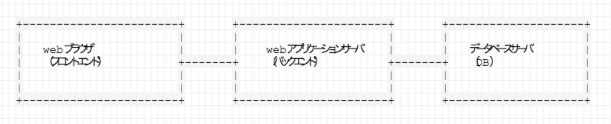
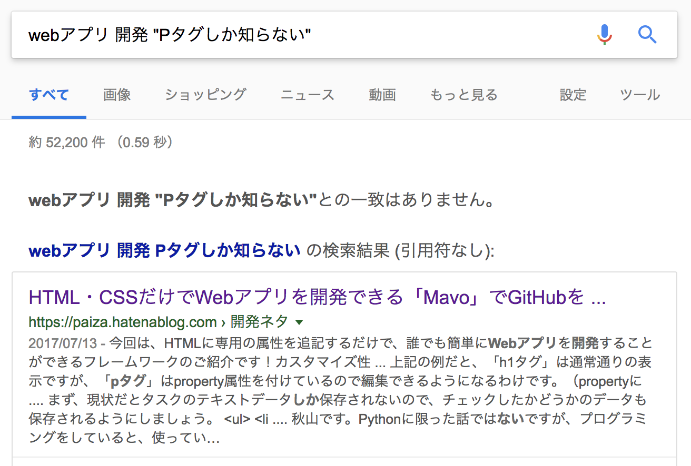

pタグしか知らないネットワークエンジニアがwebアプリを作ってみた結果・・・
==

---

実は私、TDで結構たくさん勉強会を開催しています。
==
### 勉強会の開催は楽しい。でも面倒なのが・・・

---
勉強会の参加受付
==
- 参加依頼をメールで受け取って・・・
- excelシートに書き込んで・・・
- 「空席ありますか」という質問に返信して・・・
### （参加して下さった皆さんの前で何ですけど）結構、面倒くさい！！

---
一番めんどくさいのがこれ
==
```
XX案件の柳本です。
チームメンバーから以下参加させてください。
高田
木村
橋本
```
### めんどくさポイント解説
- メールを出した本人は参加しないっぽい？
- 3人のフルネームもメアドも社員番号もわからない。
### これ毎回e電話帳で検索してexcelに載せてるんです！

---
そして出席の確認・・・
==
## 当日誰が出席してくれたかを記録して、偉い人に報告しないといけない。
- 紙配ってOつけてもらったりしますが、印刷忘れること多いです（ほぼ毎回忘れれる）
- あとで思い出してexcelに付けたりしますが、、、
### いつも来てくれるあの方、名前がわからない・・・

とかいろいろ、まあとにかく、大変です。

---
では出欠管理アプリを作ろう！
==
- excelマクロ的な？
	- 今更覚えたくないし何よりダサい。
- スマホアプリ？でも、
	- インストールしてくれるかな（怪しいし）。
	- androidならjava、iPhoneはobjective-Cかswift？
### ２つも言語使うのはちょっと・・・
- じゃあスマホでもPCでも利用できる、**webアプリ**でどや！

---

webアプリとは
==



- ブラウザから入力する。
- データベースにいろいろデータを貯める。
- webアプリケーションサーバがデータを集計して、HTMLを生成して、ブラウザに送る。
- ブラウザはHTMLを表示する。
- ゲームなど動きのあるものは、ブラウザ上のjavascriptで処理される。

---

作るにはプログラム＆HTMLの知識が必須
==
- ブラウザに表示するにはHTMLが必要。
- レイアウトとかデザインのためにCSSも必要。
- データの処理とかデータベースの制御にプログラミングも必要。
- javascriptの知識もあったほうがいい。
### 大変そう・・・やっぱexcelでええか・・・（思考停止）
## いやいや。これを乗り越えないと、また木村をe電話帳で探す日々が繰り返される・・・

---
とはいえ私、HTMLってPタグしかしらない・・・
==
- 最近書いたHTML
```
<html><body>
<h1>サーバー1号機</h1>
<p>サーバー1号機です</p>
</body></html>
```
↑webサーバの負荷試験の時に書いた（hタグも知ってたわ・・・）
いずれにしろ、見出しと段落しか作れないひどいHTMLスキルに違いはない。

---
そんな私に出来るのか調べてみる
==
- とりあえずgoogle検索


↑ベクトルが逆だけどなんか出てきた！

---
逆方向だが一応「Mavo」を確認してみる。
==
- 記事ではgithubをデータベース代わりにしてtodoアプリを作ってました。
- ちなみに、女性エンジニアを育成して水着にさせるっていうゲームで炎上したpaizaのサイト

### プログラミングはいらなくても、やはりwebアプリ開発には、HTML（とCSS）の知識は必要なのか・・・
（まぁ当たり前ですよね）

---
よろしい。HTMLとCSSくらいちょっと勉強してあげましょう。
==

---
で、開発言語はどうするか
==
- webアプリをイチから自力で作るのは大変らしい。
	- セキュリティ対策を自力で実施
	- ログインしてるかどうかの判定
	- 入力された文字の確認（電話番号に英字は使っちゃだめとか）
	- 入力されたURLの解析
- などなど。やることがいっぱいある。

### 安心してください。webアプリフレームワークがありますから。
---

webアプリケーションフレームワークとは
==
### webアプリを作るために必要な機能を提供するプログラム集的な何か
- SQLを使わずにデータベースを使える＝セキュリティが強固
- ログインしてない場合に強制的にログインページに飛ばせる
- データが沢山ある場合に自動で表にしてくれる
- HTMLの雛形にデータを入れてくと自動でHTMLができる。
### 「やりたいことをプログラム化」することだけに集中できる仕組み。

---

webアプリフレームワークといえば・・・
==
- webアプリ開発といえば、ruby on railsやangular(javascript)が有名らしいですが・・・もちろんpythonにもあります！
### ちょっと今python以外に手を出す余裕がないのでpythonを使いたい。

---
python webフレームワーク紹介
==
### bottle（ボトル）
- なんと1つのファイルだけで出来てる超軽量フレームワーク
### django（ジャンゴ）
- データベース機能などを持ち規模は大きいが出来ることも多い
### flask（フラスコ）
- bottleとdjangoの中間的な位置づけ？
## 一番機能充実の「django」を使うことにしました。

---

アプリでやることと使い方を決める
==
### とりあえず実現できそうなんで、やることを決めよう
- 勉強会の告知メールにwebアプリのURLを記載
- 参加したい人はURLにアクセスしてログイン＆参加表明
- 当日は画面にQRコードを出しておいて、出席した人がスマホで読み込み
- 出席者も出席率もレポートですぐ出せる。

### 要件定義　＆　ユースケース定義　終　了　！

---
いきなり実装
==
- 業務じゃないし設計は面倒なのでしない。実装しながら考える。
- ネット上にあるチュートリアルを混ぜながらゴロゴリ実装。
https://qiita.com/maisuto/items/17653f344d1f64afa019#_reference-e7c814437e13487a01b2
https://djangogirlsjapan.gitbooks.io/workshop_tutorialjp/

- しかし中々ネットだけでは欲しい情報にたどり着けなかったりするので、本くらいは買ったほうがいいんでしょうね・・・（今回は買わなかった）

---
HTML意外と使わないwww
==
- HTML/CSSはチュートリアルからコピペで済ませた。
- 見た目をシャレオツにしてくれるHTML/CSSのフレームワークがいっぱいある。
	- 今回はbootstrapというのを使用
	- twitter製 
- ほとんどHTMLの知識なしで実装は進むが・・・

---
HTMLよりもデータベースで壁にぶち当たる
==
### データベースが全然わからない
- エンジニア歴11年でデータベース未経験(///)
- 参加者テーブルと勉強会テーブルをページに表示するとこまではすぐできた。
- **どの勉強会に誰が参加したのかを紐付る方法（２つのテーブルを紐付ける方法）がわからん！**
---

データベースに怖気づく日々
==
- リレーションとやらを使えば出来るのはなんとなくわかった。
	- 勉強会テーブルに参加者カラムを作る。
	- 参加者テーブルのIDカラム（社員番号）を勉強会テーブルの参加者カラムに紐付ける。
- でもdjangoで実装する方法がわかりません(´・ω・｀)
- ネットで得られる情報は大体SQLを使ったもの。
- djangoはデータベースをSQLで扱わないのでネットの例がそのまま使えない。 
	- djangoのORマッパーでは、レコードをpythonオブジェクトとして扱います（ちょっと何言ってるかわかんない）

---
とりあえず実験してみる
==
- なんとなくわかったけど、実装して、動いてるやつが動かなくなったらやだなあ・・・
- しかし止まっていてもしょうがない。。できそうなことを実験してみよう。
	- djangoは、データベースとかを全部読み込んだ状態でpythonインタプリタを起動することもできます。
- **そしたらめちゃくちゃあっさりできたｗ**
### あれこれ考えるよりとりあえず実験してみましょう。

---
第１号完成！しかし衝撃の事実が発覚
==
- ５月終わり頃、ようやく第1号が完成！
- 見た目はクソだが（HTML知らないので）、要件は満たしていた。 
- さーそろそろHTML/CSS勉強して、見た目もシャレオツにするで、と意気揚々。
- と、そんなある日の帰り道、衝撃的な発見をしてしまう。
### ほぼ同じアプリが、githubですでに公開済みでしたｗｗｗ
https://github.com/iyanuashiri/meethub

---
車輪の再発明は悪だ。第1号は廃棄処分とする
==
- というわけで、meethubをクローンして再実装開始
- 全部実装済みだったらどうしよう・・・と思ったけど、驚くほど低機能だったので（失礼）やることはたくさんあった。
- デザインはそのまんま使用
	- またしてもHTML/CSS触ってません（＝知識増加量ゼロ）
- 機能追加はめちゃくちゃ楽
	- 例えば表示する項目を増やしたいときは、引数の辞書に項目を追加するだけ。
	- ただし、インスタンス化とか継承とかオーバーライドとかオブジェクト指向を分かってないと辛い。
---
勉強会出欠管理システム「TD-Semi」完成
==

実物お披露目タイム

---
まとめ
==
- HTML/CSSを知らなくてもwebアプリは作れる（ただし見た目はクソ）
- 何かを作り出す前には、似たようなのがすでに存在しないかを先に確認したほうがよい。
- データベースはアプリケーションの肝。というより、アプリケーションというのは、データベースを使いやすく、見栄えを良くするものでしかない。
- 悩んだらまず実験。
- オブジェクト指向大事。
- モノづくり楽しうぃ。

---
# ご清聴ありがとうございました。
